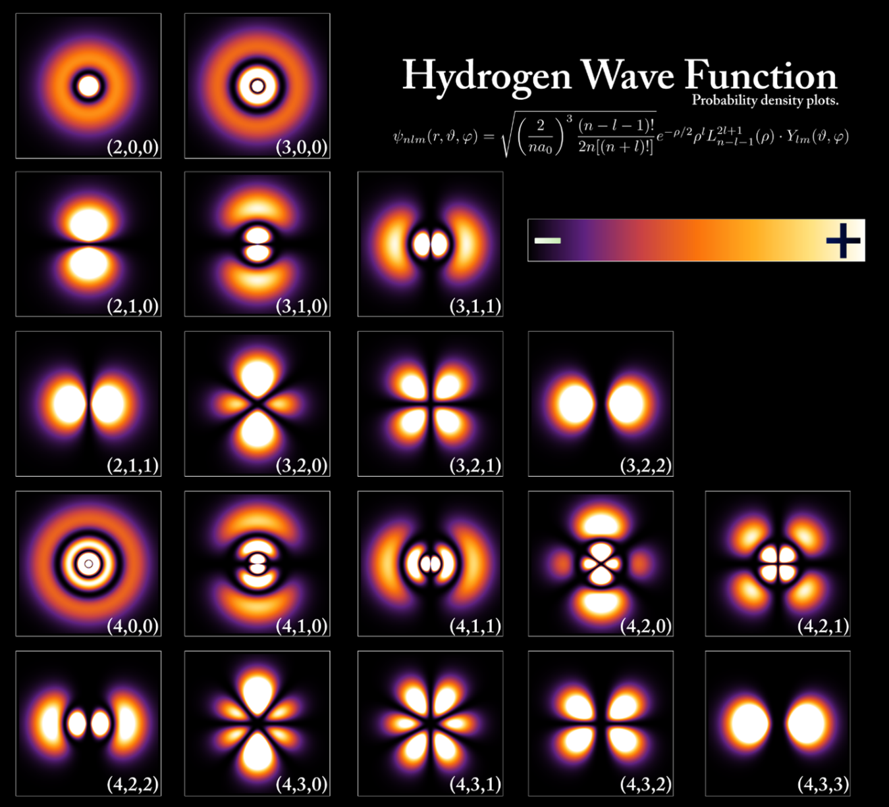

class: center
name: title
count: false

# Who needs math anyway?

.me[.grey[*by* **Nicholas Matsakis**]]
.left[.citation[View slides at `https://nikomatsakis.github.io/math-is-more-than-numbers/`]]

---

# What is math?

--

---

# So...math is numbers?

---

# I claim...

Math is **not just numbers**.

In fact, math can be **philosophy** -- or anything at all.

--

---

# I want to convince you...

Math is two things

* Speaking precisely and unambiguously
* Abstraction

---

# Precisely and unambiguously

--

---

# Precisely and unambiguously

Is this true?

## All kids like candy

???

How many say yes? (raise your hands)

How many say no? (raise your hands)

OK, so some say yes, some say no, let's see.

Let's test it!

Bring out a bag of dum-dums.

OK, I've got some candy. Who wants some?

Get out the black licorice. OK, good, this is some candy I brought home from the Netherlands. It's called Double Salt Licorice. Does anybody want to try it?

OK, who can tell me what's the problem?

(give them a piece of candy)

---

# How to write this more clearly

What exactly does "all kids like candy mean"...

* All kids like *all* candy?
* All kids like *some* candy?
* Most kids like *some* candy?

It's kind of hard to tell.

---

# Answer: equations

* Write $(K)$ for a kid
* Write $(C)$ for a kind of candy
* Then we can write a predicate $(K\:likes\:C)$

A **predicate** is something that can be *true* or *false*

???

So, is `K likes C` true... or false?

(If somebody answers, good, and give them candy if they seem to have made a good effort. 

If not, we'll start to probe -- how many say yes, no, not sure.)

The answer is "it depends". Which kid, which candy?

K and C are *variables*, just like you've seen elsewhere.

So depending on what values we give them, this might be true or false. 

Pick a kid who seems shy -- so, what's your name. And do you like dum-dums or jolly ranchers?

Write, so if K is X, and C is dum-dums, the statement is true. But if C is double salt licorice, maybe not.

(give them candy too)

---

# "For all"

Here is a predicate

$$\forall K:Kid. \forall C:Candy. K\:likes\:C$$

What does it mean?

"For any kid $(K)$

and any kind of candy $(C)$

the kid $(K)$ likes the candy $(C)$"

**So, what would it take to make this true?**

---

# "There exists"

Here is a predicate

$$\exists K:Kid. \exists C:Candy. K\:likes\:C$$

What does it mean?

"There exists some kid $(K)$

and some kind of candy $(C)$

such that the kid $(K)$ likes the candy $(C)$"

**So, what would it take to make this true?**

---

# What does this mean?

Here is a predicate

$$\forall K:Kid. \exists C:Candy. K\:likes\:C$$

--

What does it mean?

"For any kid $(K)$

there is some kind of candy $(C)$

such that the kid $(K)$ likes the candy $(C)$"

---

# What does this mean?

Here is a predicate

$$\exists K:Kid. \forall C:Candy. K\:likes\:C$$

---

# How do you know what is *true*?

Go back to this one...

$$\forall K:Kid. \forall C:Candy. K\:likes\:C$$

...how did we know it is *false*?

???

Idea: counterexample

---

# Philosophy

    
    Aristotle (384BC - 322BC)

* Studied under Plato
* Taught Alexander the Great
* Developed the idea of analyzing the *structure* of an argument

---

# Logic in other parts of the world

* Logic also developed in [China](https://en.wikipedia.org/wiki/Logic_in_China), where **Mozi** (470 - 391 BC) taught about correct conclusions, but didn't use mathematical reasoning.
* And in [India](https://en.wikipedia.org/wiki/Logic_in_India), where **Panini** (5th century BC) and the **Nyaya** school (~200 CE) is the closest to what we are discussing here.

Indian logic in particular influenced a lot of what we are describing here.

.footnote[
    I'm leaving out a *lot* of details. Read the Wikipedia pages!
]

---

# Back to Aristotle

.p20[]

.abspos.top225.left210[.speech-bubble.alan.left["So what *is* true?"]]

* Aristotle is a person
* All people are mortal
* Therefore Aristotle is...?

---

# Imagine...

    
    "I caught him!"

* The thief had red hair
* This person has red hair
* Therefore... this person is the thief?

Is this a valid conclusion?

Why or why not?

---

# Or perhaps

* Licorice is a candy
* All kids like candy
* Therefore... all kids like licorice!

Where does it go wrong?

---

# This is hard

.p20[]

.abspos.top225.left210[.speech-bubble.alan.left["Is *anything*   really *true*?"]]

---

# Remember this?

Math is two things

* Speaking precisely and unambiguously
* **Abstraction**

---

# Abstraction

Abstraction = ignoring irrelevant details

What's irrelevant? Well, that depends.

--

* Licorice is a candy -- well, what *is* a candy?

--

* This classroom has walls -- does it?

---

# Heisenberg's uncertainty principle

The more precisely you know...

* how fast something is going

...the less precisely you know...

* where that thing is.
---

# Quantum superposition

---

# And yet

---

# And yet...

.p20[]

.abspos.top225.left230[.speech-bubble.alan.left[
"This makes my head hurt.

Let's make the problem simpler."
]]

---

# Aristotelian logic

* Every predicate $(P)$ is either **true** or **false**
* Predicates can be
    * a base fact (*sugar is sweet*)
    * or a **combination** of facts made with an **operator**

---

# Combination with an operator...?

In math so far you've learned

* **numbers** $((1, 2))$
* **combinations** of numbers $((1 + 2))$ made with **operators** like $(+)$

---

# Combination with an operator...?

What if we did that with **predicates**

* a **predicate** like *sugar is sweet* or *licorice is candy*
* **combinations** of predicates like 
    * $(P \wedge Q)$ = $(P)$ **and** $(Q)$ = true if $(P)$ and $(Q)$ are both true
    * $(P \vee Q)$ = $(P)$ **or** $(Q)$ = true if either $(P)$ or $(Q)$ is true
    * $(P \Rightarrow Q)$ = $(P)$ **implies** $(Q)$ = if $(P)$ is true, then $(Q)$ must be true

---

# Example

Two predicates:

* $(A)$ = $(sugar\:is\:sweet)$
* $(B)$ = all kids like all candy
* $(C)$ = all kids like some candy

What is true?

* is $(A)$ true? $(B)$? $(C)$?
* what about $(A \wedge B)$ ($(A)$ and $(B)$)?
* what about $(A \vee B)$ ($(A)$ or $(B)$)?
* what about $(A \wedge C)$ ($(A)$ and $(C)$)?

---

# Add variables

In math so far you've learned

* *numbers* $((1, 2))$
* *combinations* of numbers $((1 + 2))$ made with *operators* like $(+)$
* **variables** like $(X)$ that represent an unknown number

---

# Add variables

In logic we have...

* a *predicate* like *sugar is sweet* or *licorice is candy*
* *combinations* of predicates like 
    * $(P \wedge Q)$ = $(P)$ *and* $(Q)$ = true if $(P)$ and $(Q)$ are both true
    * $(P \vee Q)$ = $(P)$ *or* $(Q)$ = true if either $(P)$ or $(Q)$ is true
    * $(P \Rightarrow Q)$ = $(P)$ **implies** $(Q)$ = if $(P)$ is true, then $(Q)$ must be true
* **variables** like $(X)$ that represent an unknown **thing**

---

# So then we can make patterns

    

        
If

        <ul>
            <li>every $(X)$ is $(Y)$ <em>and</em></li>
            <li>$(Z)$ is an $(X)$</li>
        </ul>
        
then

        <ul>
            <li>$(Z)$ is $(Y)$</li>
        </ul>
    

    

        
If $(X = \text{person})$, $(Y = \text{mortal})$, and $(Z = \text{Socrates})$, then...

        <ul>
            <li>every <strong>person</strong> is <strong>mortal</strong> <em>and</em></li>
            <li><strong>Socrates</strong> is a <strong>person</strong></li>
        </ul>
        
then

        <ul>
            <li><strong>Socrates</strong> is <strong>mortal</strong></li>
        </ul>
    

Or written in more mathematical notation

$$\forall X, Y, Z. (X\:is\:Y \wedge Z\:is\:X) \Rightarrow Z\:is\:Y$$