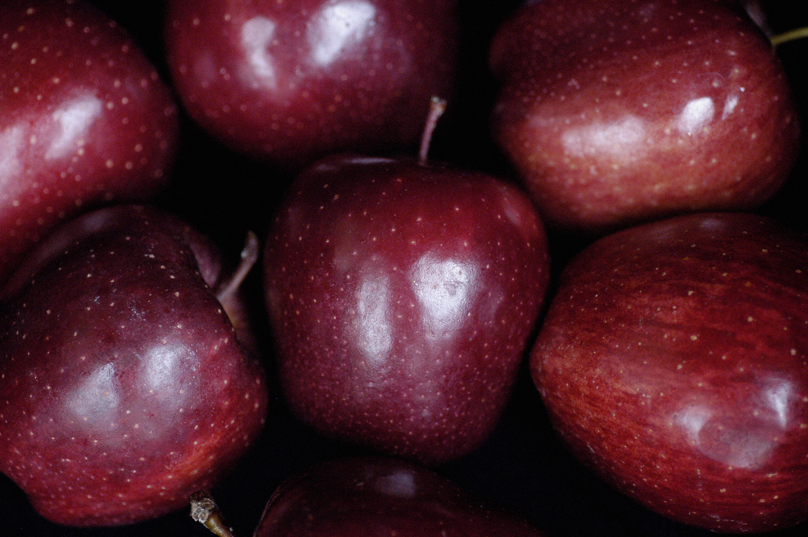

class: center
name: title
count: false

# Who needs math anyway?

.me[.grey[*by* **Nicholas Matsakis**]]
.left[.citation[View slides at `https://nikomatsakis.github.io/math-is-more-than-numbers/`]]

---

# What is math?

---

# So...math is numbers?

---

# I claim...

Math is **not just numbers**.

In fact, math can be **philosophy** -- or anything at all.

--

---

# I claim...

Math is two things

* Precision
* Abstraction

---

# Precision

--

---

# Precision

Is this true?

## All kids like candy

???

How many say yes? (raise your hands)

How many say no? (raise your hands)

OK, so some say yes, some say no, let's see.

Let's test it!

Bring out a bag of dum-dums.

OK, I've got some candy. Who wants some?

Get out the black licorice. OK, good, this is some candy I brought home from the Netherlands. It's called Double Salt Licorice. Does anybody want to try it?

OK, who can tell me what's the problem?

(give them a piece of candy)

---

# How to write this more clearly

What exactly does "all kids like candy mean"...

* All kids like *all* candy?
* All kids like *some* candy?
* Most kids like *some* candy?

It's kind of hard to tell.

---

# Answer: equations

* Write $(K)$ for a kid
* Write $(C)$ for a kind of candy
* Then we can write a predicate $(K\:\text{likes}\:C)$

A **predicate** is something that can be *true* or *false*

???

So, is `K likes C` true... or false?

(If somebody answers, good, and give them candy if they seem to have made a good effort. 

If not, we'll start to probe -- how many say yes, no, not sure.)

The answer is "it depends". Which kid, which candy?

K and C are *variables*, just like you've seen elsewhere.

So depending on what values we give them, this might be true or false. 

Pick a kid who seems shy -- so, what's your name. And do you like dum-dums or jolly ranchers?

Write, so if K is X, and C is dum-dums, the statement is true. But if C is double salt licorice, maybe not.

(give them candy too)

---

# "For all"

Here is a predicate

$$\forall K:Kid. \forall C:Candy. K\:\text{likes}\:C$$

What does it mean?

"For any kid $(K)$

and any kind of candy $(C)$

the kid $(K)$ likes the candy $(C)$"

**So, is this true?**

???

No?

How do you know?

---

# Proving things false

Given a predicate like

$$\forall K:Kid. \forall C:Candy. K\:\text{likes}\:C$$

I can prove it false via counterexample:

* Can you give me a kid $(K)$
* and some candy $(C)$ 
* where the kid $(K)$ doesn't like the candy $(C)$?

Then this predicate must be false.

---

# "There exists"

Here is a predicate

$$\exists K:Kid. \exists C:Candy. K\:\text{likes}\:C$$

What does it mean?

"There exists some kid $(K)$

and some kind of candy $(C)$

such that the kid $(K)$ likes the candy $(C)$"

**So, what would it take to make this true?**

---

# Proving things true

Given a predicate like

$$\exists K:Kid. \exists C:Candy. K\:\text{likes}\:C$$

I can prove it true by an example:

* Can you give me a kid $(K)$
* and some candy $(C)$ 
* where the kid $(K)$ likes the candy $(C)$?

---

# What does this mean?

Here is a predicate

$$\forall K:Kid. \exists C:Candy. K\:\text{likes}\:C$$

--

What does it mean?

"For any kid $(K)$

there is some kind of candy $(C)$

such that the kid $(K)$ likes the candy $(C)$"

---

# Proving true or false

OK, so, given this predicate

$$\forall K:Kid. \exists C:Candy. K\:\text{likes}\:C$$

* What does it mean?
* How could I prove it to be **false**?
* How could you prove it to be **true**?

--

* Could you modify it to be something you can prove true?

???

Idea: for any kid in the classroom.

---

# What does this mean?

Here is one last predicate, this is a fun one

$$\exists K:Kid. \forall C:Candy. K\:\text{likes}\:C$$

Who can explain to me what *this* means?

---

# Math meets philosophy

--

---

# Math meets philosophy

---

# It all started with Aristotle...

    
    Aristotle (384BC - 322BC)

* Studied under Plato
* Taught Alexander the Great
* Developed the idea of analyzing the *structure* of an argument

---

# Logic in other parts of the world

* Logic also developed in [China](https://en.wikipedia.org/wiki/Logic_in_China), where **Mozi** (470 - 391 BC) taught about correct conclusions, but didn't use mathematical reasoning.
* And in [India](https://en.wikipedia.org/wiki/Logic_in_India), where **Panini** (5th century BC) and the **Nyaya** school (~200 CE) is the closest to what we are discussing here.

Indian logic in particular influenced a lot of what we are describing here.

.footnote[
    I'm leaving out a *lot* of details. Read the Wikipedia pages!
]

---

# Back to Aristotle

.p20[]

.abspos.top225.left210[.speech-bubble.alan.left["So what *is* true?"]]

* Aristotle is a person
* All people are mortal
* Therefore Aristotle is...?

---

# Or perhaps

* Licorice is a candy
* All kids like candy
* Therefore... all kids like licorice!

Where does it go wrong?

---

# Imagine...

    
    "I caught him!"

* The thief had red hair
* This person has red hair
* Therefore... this person is the thief?

Is this a valid conclusion?

Why or why not?

---

# This is harder than it seems

.abspos.left50.top80[.p40[]]

.abspos.top150.left210[.speech-bubble.alan.left[
"I want to decide 
what is *true*."
]]

.abspos.left600.top120[.p40[]]

.abspos.top250.left350[.speech-bubble.barbara.right[
"Ah, but is *anything*
  really *true*?"
]]

.abspos.left50.top320[.p40[]]

.abspos.top390.left210[.speech-bubble.alan.left[
"Of course. Red delicious 
apples are red, aren't they?"
]]

.abspos.left600.top430[.p40[]]

.abspos.top530.left415[.speech-bubble.barbara.right[
"But *are* they?"
]]

---

# What do you think?

.p60[]

Are red delicious apples red?

---

# And yet...

.p20[]

.abspos.top225.left230[.speech-bubble.alan.left[
"This makes my head hurt.

Let's make the problem simpler."
]]

---

# Remember this?

Math is two things

* Precision
* **Abstraction**

---

# Abstraction

Abstraction = ignoring irrelevant details

What's irrelevant? Well, that depends.

---

# Numbers are abstractions

* 2 apples + 2 apples = 4 apples
* 2 oranges + 2 oranges = 4 oranges
* 2 + 2 = 4

---

# Aristotelian logic

* Every predicate $(P)$ is either **true** or **false**
* Use **variables** like $(X)$ or $(Y)$ to represent unknown things

---

# Patterns for valid kinds of arguments

If

* Every **person** is **mortal**
* **Socrates** is a **person**

Then

* **Socrates** is **mortal**

---

# It doesn't always have to be PERSON

If

* Every **X** is **mortal**
* **Socrates** is a **X**

Then

* **Socrates** is **mortal**

---

# It doesn't always have to be MORTAL

If

* Every **X** is **Y**
* **Socrates** is a **X**

Then

* **Socrates** is **Y**

---

# It doesn't always have to be SOCRATES

If

* Every **X** is **Y**
* **Z** is a **X**

Then

* **Z** is **Y**

---

# We can use this for all kinds of stuff

If

* Every **liquid** is **wet**
* **Water** is a **liquid**

Then

* **Water** is **wet**

---

# We can use this for all kinds of stuff

If

* Every **kid in Somerville** is **awesome**
* **You** are a **kid in Somerville**

Then

* **You** are **awesome**

.p60[.abspos.left500.top350[]]

---

# But wait

If

* Every **candy** is **yummy**
* **Black licorice** is a **candy**

Then

* **Black licorice** is **yummy**

Hmm, what's wrong here?

---

# Other kinds of logic

* Every predicate $(P)$ is either **true** or **false**

In the real world, this is usually **too simple**.

A statement like **candy is yummy** is not really true or false, right?
The answer is more like, "it depends".

---

# Other kinds of logic

**Natural logic:** predicates can be true, false, or... "maybe, it depends"

Example:

Apples are red

---

# Other kinds of logic

**Modal logic:** Some things may not be true *now*, but they become true later -- or they may not.

Deals in **possible futures**.

---

# Other kinds of logic

...there are tons more...

---

# In my job...

I work with computers and programming.

We do a lot with logic -- trying to figure out if a program is correct or if it might have problems.

This is very mathematical, but there are **no numbers**
